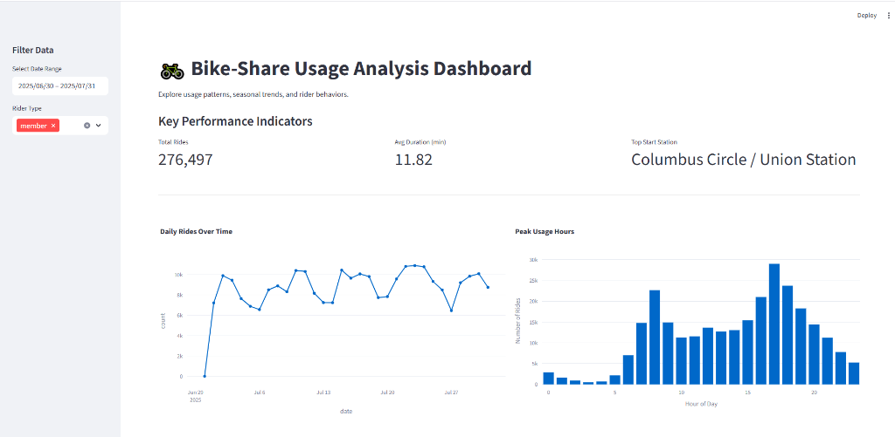
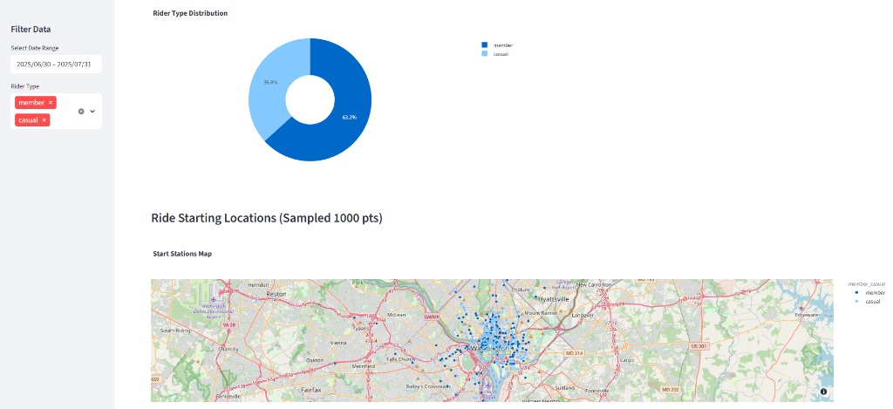

# Exploratory Analysis of Bike-Share Rider Patterns

**August 2025**

## 1. Overview

This project performs an exploratory data analysis (EDA) on a bike-share dataset. The primary goal is to understand the usage patterns of the bike-share service by analyzing the behavior of its two main user groups: subscribed "members" and casual "riders".

The analysis focuses on answering the following key questions:
- How does ridership vary by time of day, day of the week, and month?
- What are the differences in trip duration and usage patterns between members and casual riders?
- Which bike stations are the most popular starting points?

## 2. Dataset

The data used for this analysis is a collection of bike trip records.

It contains information about individual trips, including:
- Trip start and end times
- Start and end station names and locations
- Rider type (member or casual)
- Bike type (classic, electric, etc.)

## 3. Tools and Libraries

The analysis was conducted using Python 3 in a Jupyter Notebook environment. The following libraries were essential for the project:

- **Pandas:** For data manipulation, cleaning, and aggregation.
- **NumPy:** For numerical operations.
- **Matplotlib & Seaborn:** For data visualization and creating insightful plots.

## 4. Project Workflow

The project followed a structured data analysis process:

1.  **Data Cleaning:**
    - Addressed significant missing values in station information by removing rows corresponding to "dockless" trips.
    - Ensured data integrity by checking for duplicates and inconsistencies.

2.  **Data Transformation:**
    - Converted `started_at` and `ended_at` columns from `object` to `datetime` format to enable time-based calculations.

3.  **Feature Engineering:**
    - Created new columns to facilitate deeper analysis, including:
        - `ride_duration`: Calculated in minutes for each trip.
        - `start_hour`: Extracted the hour of the day to identify peak usage times.
        - `day_of_week`: Extracted the day of the week to analyze weekly patterns.
        - `month`: Extracted the month to observe seasonal trends.

4.  **Exploratory Data Analysis (EDA) & Visualization:**
    - Created various visualizations (bar charts, line charts, histograms) to identify key patterns and compare rider behaviors.

## 5. Key Findings

The analysis revealed several key insights into the bike-share service's usage:

* **Rider Type Behavior:** Casual riders tend to take significantly longer trips, especially on weekends, suggesting leisure and tourism use. In contrast, members' trips are shorter and more frequent on weekdays, indicating a strong pattern of commuting.
* **Peak Usage Times:** Ridership on weekdays shows a clear bimodal distribution, with peaks at 8 AM and 5 PM, aligning with standard work commute times. Weekend usage is more evenly spread throughout the afternoon.
* **Seasonal Trends:** The service sees the highest usage during the warmer months (from May to September) and a noticeable decline during the winter.
* **Popular Stations:** The most frequently used start stations are located in downtown commercial areas and near major public transit hubs, reinforcing the conclusion that commuting is a primary use case.

## 6. How to Run This Project

### Prerequisites
- Python 3.8+
- Jupyter Notebook Support

### Installation
1.  **Clone the repository**:
    ```bash
    git clone https://github.com/faizansk25/Analysis-of-Bike-Share-Rider-Patterns.git
    cd Analysis-of-Bike-Share-Rider-Patterns
    ```

2.  **Install Dependencies**:
    ```bash
    pip install -r requirements.txt
    ```

3.  **Data Setup**:
    - The raw dataset `bikeshare.csv` is included in this repository via **Git LFS**.
    - If the file is a pointer (small size) after cloning, run:
      ```bash
      git lfs pull
      ```
    - Open `Bike-Share Usage Analysis.ipynb` and run all cells. This will generate the `cleaned_bikeshare.csv` used by the dashboard.

4.  **Launch Dashboard**:
    ```bash
    streamlit run dashboard.py
    ```

## 7. Future Work

This EDA serves as a foundational analysis of rider patterns. The next logical step for this project is to integrate an external weather dataset. This will allow for a deeper analysis to determine how factors like **temperature**, **precipitation**, and **wind speed** correlate with bike rental demand, ultimately building a predictive model for the service.

---
**Author:** Faizan Muktar Shaikh

## 8. Dashboard Preview


*Overview of Key Metrics and Trends*


*Rider Distribution and Station Map*